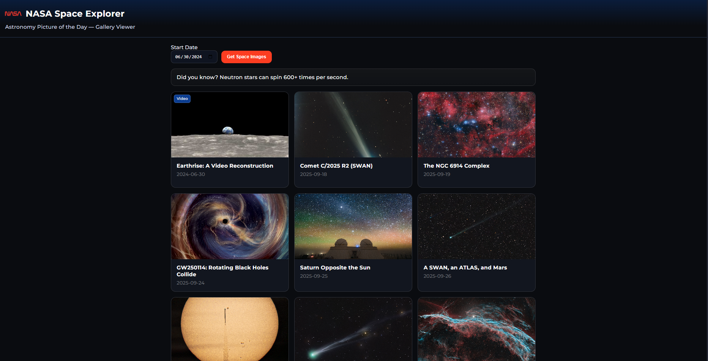

# 🚀 NASA Space Explorer

A web application that explores NASA’s Astronomy Picture of the Day (APOD) data through an interactive gallery.  
The project focuses on working with real-world API-style data, dynamic rendering, and user-friendly visualization.

---

---

## ✨ Overview

NASA Space Explorer allows users to browse space imagery and videos from NASA’s Astronomy Picture of the Day archive.

Users can:
- Select a starting date to explore space content over time
- View images and videos in a responsive gallery layout
- Open a detailed modal with high-resolution media and explanations
- Interact with content regardless of media type (image or video)

The focus of this project is **API-style data consumption**, **dynamic UI rendering**, and **robust edge-case handling**.

---

## 🚀 Key Features

- **Dynamic APOD Gallery**
  - Fetches APOD-style entries from a JSON feed structured like NASA’s real APOD API
  - Displays a consistent grid of content cards with titles and dates

- **Media-Type Handling**
  - Supports both images and videos
  - Automatically renders thumbnails, embeds videos, or displays high-resolution images as needed

- **Date-Based Exploration**
  - Users choose a start date to explore content over a rolling time window
  - Gracefully extends the range if data is missing to ensure a complete gallery view

- **Detailed Modal View**
  - Click any item to open a modal with media, title, date, and explanation
  - Responsive layout adapts for desktop and mobile screens

- **User Experience Enhancements**
  - Loading states for data fetching
  - Keyboard-accessible interactions
  - Random space facts to enhance engagement

---

## 🛠️ Technical Stack

- **Frontend:** HTML, CSS, JavaScript (ES6)
- **Data Source:** APOD-style JSON feed (mirrors NASA APOD API fields)
- **UI Patterns:** Responsive grid, modal dialogs
- **State Handling:** In-memory data mapping and date-based indexing

---

## 🧩 Architecture Notes

- Data is fetched once and indexed by date for efficient access.
- The gallery dynamically renders content based on user-selected dates.
- Media rendering logic adapts automatically based on the `media_type` field.
- Fallback logic ensures the UI never appears empty due to missing data.

---

## ⚠️ Disclaimer

This project is a **demonstration application built for learning purposes**.  
It is **not an official NASA product or service**.

---

## 👤 Author

**Shivraj Jadeja**  
Software Engineering Apprentice – Global Career Accelerator
